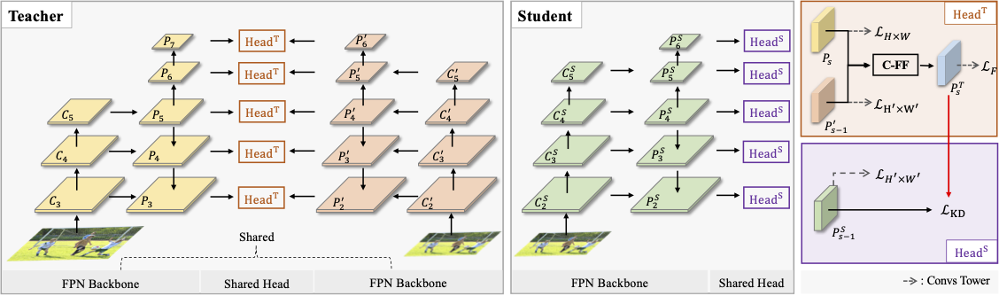

# MSAD
**Multi-Scale Aligned Distillation for Low-Resolution Detection**

Lu Qi*, Jason Kuen*, Jiuxiang Gu, Zhe Lin, Yi Wang, Yukang Chen, Yanwei Li, Jiaya Jia

<!-- [[`arXiv`](https://arxiv.org/pdf/2012.00720.pdf)] [[`BibTeX`](#CitingPanopticFCN)] -->

<div align="center">
  
</div><br/>

This project provides an implementation for the CVPR 2021 paper "[Multi-Scale Aligned Distillation for Low-Resolution Detection](https://jiaya.me/papers/ms_align_distill_cvpr21.pdf)" based on [Detectron2](https://github.com/facebookresearch/detectron2). MSAD targets to detect objects using low-resolution instead of high-resolution image. MSAD could obtain comparable performance in high-resolution image size. Our paper use [Slimmable Neural Networks](https://arxiv.org/abs/1812.08928) as our pretrained weight.


## Installation
This project is based on [Detectron2](https://github.com/facebookresearch/detectron2), which can be constructed as follows.
* Install Detectron2 following [the instructions](https://detectron2.readthedocs.io/tutorials/install.html).
* Setup the dataset following [the structure](https://github.com/facebookresearch/detectron2/blob/master/datasets/README.md).
* Copy this project to `/path/to/detectron2/projects/MSAD`
* Download the slimmable networks in the [github](https://github.com/JiahuiYu/slimmable_networks). The slimmable resnet50 pretrained weight link is [here](https://drive.google.com/open?id=1f6q37OkZaz_0GoOAwllHlXNWuKwor2fC).

## Pretrained Weight
* Move the pretrained weight to your target path 
* Modify the weight path in configs/Base-SLRESNET-FCOS.yaml

## Teacher Training
To train teacher model with 8 GPUs, run:
```bash
cd /path/to/detectron2
python3 projects/MSAD/train_net_T.py --config-file <projects/MSAD/configs/config.yaml> --num-gpus 8
```

For example, to launch MSAD teacher training (1x schedule) with Slimmable-ResNet-50 backbone in 0.25 width on 8 GPUs and save the model in the path "/data/SLR025-50-T".
one should execute:
```bash
cd /path/to/detectron2
python3 projects/MSAD/train_net_T.py --config-file projects/MSAD/configs/SLR025-50-T.yaml --num-gpus 8 OUTPUT_DIR /data/SLR025-50-T 
```

## Student Training
To train student model with 8 GPUs, run:
```bash
cd /path/to/detectron2
python3 projects/MSAD/train_net_S.py --config-file <projects/MSAD/configs/config.yaml> --num-gpus 8
```

For example, to launch MSAD student training (1x schedule) with Slimmable-ResNet-50 backbone in 0.25 width on 8 GPUs and save the model in the path "/data/SLR025-50-S". We assume the teacher weight is saved in the path "/data/SLR025-50-T/model_final.pth"
one should execute:
```bash
cd /path/to/detectron2
python3 projects/MSAD/train_net_S.py --config-file projects/MSAD/configs/MSAD-R50-S025-1x.yaml --num-gpus 8 MODEL.WEIGHTS /data/SLR025-50-T/model_final.pth OUTPUT_DIR MSAD-R50-S025-1x
```

## Evaluation
To evaluate a teacher or student pre-trained model with 8 GPUs, run:
```bash
cd /path/to/detectron2
python3 projects/MSAD/train_net_T.py --config-file <config.yaml> --num-gpus 8 --eval-only MODEL.WEIGHTS model_checkpoint
```
or
```bash
cd /path/to/detectron2
python3 projects/MSAD/train_net_S.py --config-file <config.yaml> --num-gpus 8 --eval-only MODEL.WEIGHTS model_checkpoint
```


## Results
We provide the results on COCO *val* set with pretrained models. In the following table, we define the backbone FLOPs as capacity. For brevity, we regard the FLOPs of Slimmable Resnet50 in width 1.0 and high resolution input (800,1333) as 1x. 

<table><tbody>
<!-- START TABLE -->
<!-- TABLE HEADER -->
<th valign="bottom">Method</th>
<th valign="bottom">Backbone</th>
<th valign="bottom">Capacity</th>
<th valign="bottom">Sched</th>
<th valign="bottom">Width</th>
<th valign="bottom">Role</th>
<th valign="bottom">Resolution</th>
<th valign="bottom">BoxAP</th>
<th valign="bottom">download</th>
<tr><td align="left">FCOS</td>
<td align="center">Slimmable-R50</td>
<td align="center"> 1.25x </td>
<td align="center">1x</td>
<td align="center">1.00</td>
<td align="center">Teacher</td>
<td align="center">H & L</td>
<td align="center"> 42.8 </td>
<td align="center"> <a href="https://drive.google.com/file/d/1F0iTnr2WuCsanoBaX4Ma8DZXFOnbMrDG/view?usp=sharing">model</a>&nbsp;|&nbsp;<a href="https://drive.google.com/file/d/1lEsL5ax8UaHKCc8l7_-O5OVNJeM8KUbQ/view?usp=sharing">metrics</a> </td>
<!-- <td align="center"> To be released </td> -->
</tr>
</tr>
<tr><td align="left">FCOS</td>
<td align="center">Slimmable-R50</td>
<td align="center"> 0.25x </td>
<td align="center">1x</td>
<td align="center">1.00</td>
<td align="center">Student</td>
<td align="center">L</td>
<td align="center"> 39.9 </td>
<td align="center"> <a href="https://drive.google.com/file/d/1zNvONf4CtDd-Jap3iTJgbNskJSb75roj/view?usp=sharing">model</a>&nbsp;|&nbsp;<a href="https://drive.google.com/file/d/1a3pcEO5urqoImfIxH3cgGO2PV5w0O5DV/view?usp=sharing">metrics</a> </td>
<!-- <td align="center"> To be released </td> -->
</tr>
<tr><td align="left">FCOS</td>
<td align="center">Slimmable-R50</td>
<td align="center">0.70x</td>
<td align="center">1x</td>
<td align="center">0.75</td>
<td align="center">Teacher</td>
<td align="center">H & L</td>
<td align="center">41.1</td>
<!-- <td align="center"> <a href="dd">model</a>&nbsp;|&nbsp;<a href="ss">metrics</a> </td> -->
<td align="center"> To be released </td>
</tr>
</tr>
<tr><td align="left">FCOS</td>
<td align="center">Slimmable-R50</td>
<td align="center">0.14x</td>
<td align="center">1x</td>
<td align="center">0.75</td>
<td align="center">Student</td>
<td align="center">L</td>
<td align="center"> 38.6 </td>
<!-- <td align="center"> <a href="dd">model</a>&nbsp;|&nbsp;<a href="ss">metrics</a> </td> -->
<td align="center"> To be released </td>
</tr>
<tr><td align="left">FCOS</td>
<td align="center">Slimmable-R50</td>
<td align="center">0.31x</td>
<td align="center">1x</td>
<td align="center">0.50</td>
<td align="center">Teacher</td>
<td align="center">H & L</td>
<td align="center">38.5</td>
<!-- <td align="center"> <a href="dd">model</a>&nbsp;|&nbsp;<a href="ss">metrics</a> </td> -->
<td align="center"> To be released </td>
</tr>
</tr>
<tr><td align="left">FCOS</td>
<td align="center">Slimmable-R50</td>
<td align="center">0.06x</td>
<td align="center">1x</td>
<td align="center">0.50</td>
<td align="center">Student</td>
<td align="center">L</td>
<td align="center"> 36.1 </td>
<!-- <td align="center"> <a href="dd">model</a>&nbsp;|&nbsp;<a href="ss">metrics</a> </td> -->
<td align="center"> To be released </td>
</tr>
<tr><td align="left">FCOS</td>
<td align="center">Slimmable-R50</td>
<td align="center">0.08x</td>
<td align="center">1x</td>
<td align="center">0.25</td>
<td align="center">Teacher</td>
<td align="center">H & L</td>
<td align="center">33.2</td>
<td align="center"> <a href="https://drive.google.com/file/d/19ohUxrdBL7d5hI4ZHuTH2X3H1WGUE0Ob/view?usp=sharing">model</a>&nbsp;|&nbsp;<a href="https://drive.google.com/file/d/1AEWGfUskVWU7Rs-X5Tx0g2EUs9pZElSY/view?usp=sharing">metrics</a> </td>
<!-- <td align="center"> To be released </td> -->
</tr>
</tr>
<tr><td align="left">FCOS</td>
<td align="center">Slimmable-R50</td>
<td align="center">0.02x</td>
<td align="center">1x</td>
<td align="center">0.25</td>
<td align="center">Student</td>
<td align="center">L</td>
<td align="center"> 30.3 </td>

<td align="center"> <a href="https://drive.google.com/file/d/1LCH0zfmd6ajF6B9xCuLeECwarGtBQaYP/view?usp=sharing">model</a>&nbsp;|&nbsp;<a href="https://drive.google.com/file/d/1F3afBdprbEC_NCoQrHQOllLMkA5NwoXh/view?usp=sharing">metrics</a> </td>
<!-- <td align="center"> To be released </td> -->
</tr>
</tbody></table>

## <a name="CitingMSAD"></a>Citing MSAD

Consider cite MSAD in your publications if it helps your research.

```
@article{qi2021msad,
  title={Multi-Scale Aligned Distillation for Low-Resolution Detection},
  author={Lu Qi, Jason Kuen, Jiuxiang Gu, Zhe Lin, Yi Wang, Yukang Chen, Yanwei Li, Jiaya Jia},
  journal={IEEE Conference on Computer Vision and Pattern Recognition (CVPR)},
  year={2021}
}